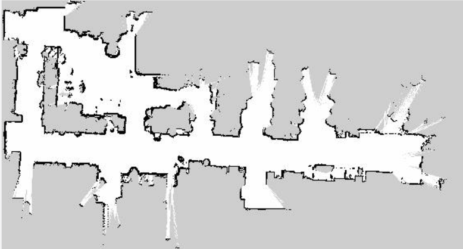

# Odometry

##  Overview

The core of this project is to show how a real mapping and localization algorithm works. Basically the pipeline is the following: from a bag we have all the values of odometry and the lidars of the AgileX Scout Mini Omnidirectional and we use them with Nav2 to make a map of the environment, once we have the map the localization and control part (always done with Nav2) starts and in the video at the end its possible to see how the robot can move and follow exactly the poses listed in a csv file.
---
## Mapping

At first we have to create our map, using **Nav2**, we can use a mapping algorithm based on the information given by the sensor and the odometry values contained into the ros bag provided. The first challenge was to convert the information of the sensor, given in a 3D form, to a 2D form that is easier to handle. Once, this was done, the entire algorithm is handled using Nav2. The configuration of Nav2 for mapping is contained in the config folder (mapper.yaml) and this has some options that help a lot during the mapping phase, such as loop closure (once a feature is re-ecountered and the algorithms corrects all the previous information of the map based on this).

This mapping stage can be executed by launching the mapping.launch file contained in the launch folder.

## Localization and Autonomous Navigation 

Now the map is available, thus the simulator **Stage** can be used. This simulates our robot in the mapped environment. To make the simulation more realistic I have decided to add some odometry error because, as we know, the odometry is always affected by drift errors. The file for Stage are contained in the world folder, there as you can see, I have added more error on the rotation, because rotation is the main reason of drift in odometry. Regarding the autonomous navigation, in the csv folder there is a csv file in which are contained a sequence of poses that my robot is able to reach. Thus I have created an action client that always call the "/navigate_through_poses" action server to send the list of goals to reach. Each new goal is set once the previous one was reached.
Then, always in Nav2, it was possible to configure the controller for the robot. Here we have a global and a local optimal trajectory. In the video below you can see the local optimal trajectory always updated and highlighted by the colored rectangle, while the global one is represented by the red line.

This video is in x4

