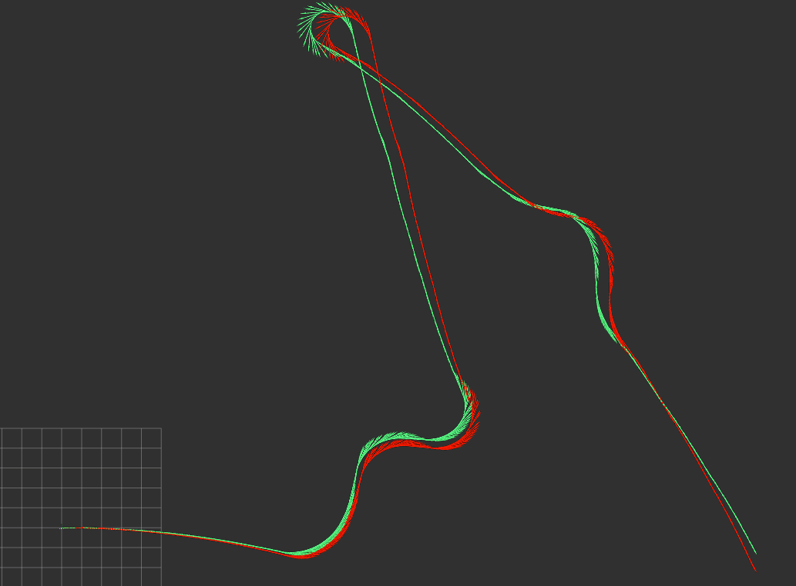

# Odometry

##  Overview

The core of this project is to show how not-reliable is odometry and how it suffers from drift effect. Indeed in this project we will compare the **real** trajectory of an Agile-x Bunker Pro, contained into a ros bag, with the **computed odometry** derived from the data of the rpm of the front-left and front-right wheels of the robot.

---
## Important Parameters

Before starting we should compute some important parameters like the **radius of the wheel** and **wheel track** because the parameters of the robot where not given. Once we know these values we can compute the **linear and angoluar speed of the robot**:

$$
\begin{cases}
\omega_{wheel} = \frac{2 \pi rpm }{60} \\
L = \frac{v_L - v_R}{\omega}
\end{cases}
$$

## Equations used for Odometry 

For computing odometry we should integrate over time using a discrete form and so these are the methods:

### Runge-Kutta (used when the angular speed is close to zero - almost rectilinear paths)

$$
\begin{cases}
x_{k+1} = x_{k} + v_{k}T_{s}cos(\theta_{k} + \frac{\omega_k T_{s}}{2}) \\
y_{k+1} = y_{k} + v_{k}T_{s}sin(\theta_{k} + \frac{\omega_k T_{s}}{2}) \\
\theta_{k+1} = \theta_{k} + \omega_k T_{s}
\end{cases}
$$

### Exact Equations (used when the angular speed is far from zero)

$$
\begin{cases}
x_{k+1} = x_{k} + \frac{v_{k}}{\omega_k}(sin(\theta_{k+1}) - sin(\theta_{k})) \\
y_{k+1} = y_{k} - \frac{v_{k}}{\omega_k}(cos(\theta_{k+1}) - cos(\theta_{k})) \\
\theta_{k+1} = \theta_{k} + \omega_k T_{s}
\end{cases}
$$

## How to use it

This program can be executed by launching the launch file contained in the folder. There is also a service, contained in the srv folder, that can be called whenever you want to reset the odometry computed till that moment 

## Results

The results can be clearly seen in the photo and in the custom message published thoughout the simulation. The error between the TF of the **real** robot and the TF of the **computed odometry** differs the most when the robot is turning. Indeed, in the image below, a screenshot from rviz2, shows exactly this. The robot starts with a perfect odometry, but from the first turn the robot begins drifting, causing a big error in the **computed odometry**. This is the reason why for localization of robots we cannot simply rely on the results coming from odometry, but we have to merge them with the results given by the measurements of the sensor (tipically lidars).
(in **green** the **computed** one, in **red** the **real** one)

